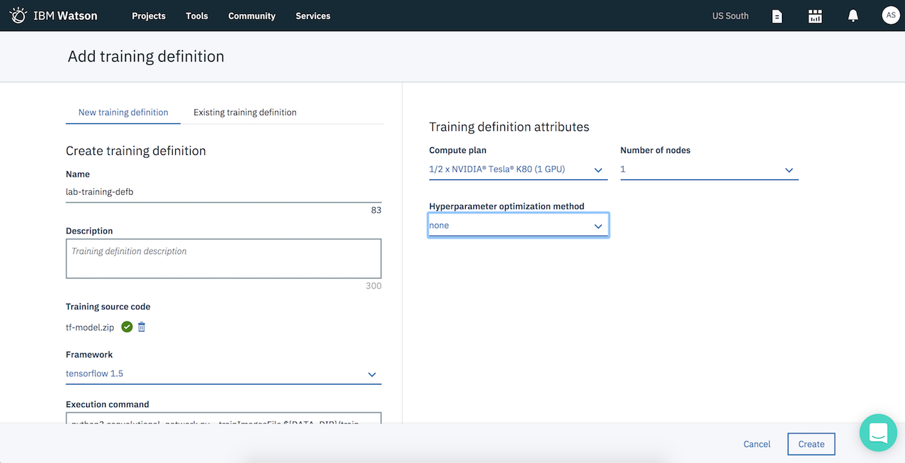
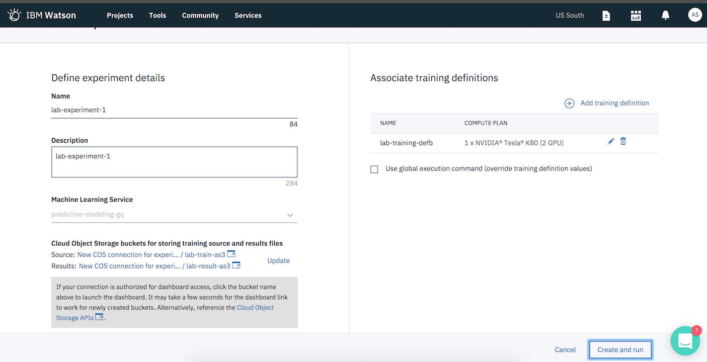

# Creating a training definition

Training definition is your manifest providing various details about the training you'd be running. On the right panel, click on the `Add training definition` link and create a `New training definition`.

1.Provide details about the experiment name and description.

2.Upload your training model code by dropping off the zip file found [here](model/) in the section marked to upload the model file. In our case we will be using the code from [here]() which is a sample MNIST program. The code contains of a python file which is basically a python program from tensorflow to train a model on MNIST dataset using convolution.

3.Select the framework as tensorflow 1.5 from the dropdown.

4.Copy the execution command as

```python
python3 convolutional_network.py --trainImagesFile ${DATA_DIR}/train-images-idx3-ubyte.gz --trainLabelsFile ${DATA_DIR}/train-labels-idx1-ubyte.gz --testImagesFile ${DATA_DIR}/t10k-images-idx3-ubyte.gz  --testLabelsFile ${DATA_DIR}/t10k-labels-idx1-ubyte.gz --learningRate 0.001 --trainingIters 200000
```

The execution command is your entry point and is what triggers your program.

5.On the `Training definition attributes` section on the right panel, select `Compute plan` as `1 x NVIDIA® Tesla® K80 (2 GPU)` . This specifies the GPUs that you will be able to use for your training. Running on a more powerful hardware is as easy as sleting a different compute configuration.

6.Since you are running a non distributed single learner training, select the number of nodes to be 1.

7.We will not be doing `Hyperparameter optimization method` as a part of this lab, so select the option as `none`.

8.Click on create button, this will create the training definition and will bring you back to the create experiment page. 



9.Click on `create and run` button and this should start the training.




10.Hurray!! You have a training running. Follow the direction [here] to see the progress of the training.